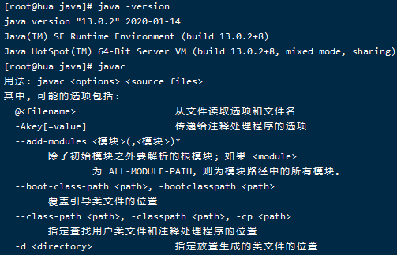

## 安装python3.7.0环境

```spreadsheet
[root@aliyun /]# tar -zxf Python-3.7.0.tgz

[root@aliyun /]# cd Python-3.7.0

[root@aliyun /]# yum install zlib-devel bzip2-devel openssl-devel ncurses-devel sqlite-devel readline-devel tk-devel gdbm-devel libpcap-devel xz-devel

[root@aliyun /]# yum -y install libffi-devel

[root@aliyun /]# yum install openssl-devel bzip2-devel expat-devel gdbm-devel readline-devel sqlite-devel gcc gcc-c++ openssl-devel

[root@aliyun /]# ./configure

[root@aliyun /]# make

[root@aliyun /]# make install
```

## 安装jdk

>说明：这里安装的是Oracle JDK，但是本人在 Centos7.4 版本上和 Centos7.7 版本上，安装 OpenJDK 13 时，并未发现问题，如有问题，欢迎在下方评论处讨论。

​	我安装的是 `OpenJDK 13` ，并将其直接放在了 `home` 文件夹下。

​	先找到已经安装的 `OpenJDK`，命令如下：

```shell
rpm -qa | grep java
```

​	将带有`OpenJDK`字样的都删除掉，例如：

```shell
yum -y remove java-1.7.0-openjdk-1.7.0.141-2.6.10.5.el7.x86_64
```

​	下面开始安装：

​	解压

```shell
# 创建文件夹，并进入
cd /usr/local/
mkdir java
cd java

# 将准备好的 JDK安装包解压到当前文件夹下
tar -zxvf /home/jdk-8u161-linux-x64.tar.gz -C ./
```

​	解压完之后， /usr/local/java ⽬录中会出现⼀个`jdk13.0.2`的文件夹.

​	配置`JDK`环境

​	编辑`/etc/profile`文件

```shell
vim /etc/profile
```

​	在⽂件尾部加⼊如下JDK 环境配置即可。（**注意：根据自己的`JDK`的版本号配置**）

```shell
JAVA_HOME=/usr/local/java/jdk-13.0.2
CLASSPATH=$JAVA_HOME/lib/
PATH=$PATH:$JAVA_HOME/bin
export PATH JAVA_HOME CLASSPATH
```

​	配置好以后，刷新一下环境变量

```shell
source /etc/profile
```

​	输入下面的命令验证结果：

```shell
java -verison
javac
```



## Centos7.4安装mysql

> 下面的文章参考某站博主`CodeSheep`大神写的开源文档，侵删！
>
> 文档在 Github 开源项目链接：https://github.com/hansonwang99/JavaCollection

### 	卸载系统⾃带的MARIADB（如果有）

​	如果系统之前⾃带`Mariadb`，可以先卸载之。

​	⾸先查询已安装的`Mariadb`安装包：

```shell
rpm -qa|grep mariadb
```


​	卸载命令：

```shell
yum -y remove mariadb-server-5.5.56-2.el7.x86_64
yum -y remove mariadb-5.5.56-2.el7.x86_64
yum -y remove mariadb-devel-5.5.56-2.el7.x86_64
yum -y remove mariadb-libs-5.5.56-2.el7.x86_64
```

### 解压`Mysql`安装包

​	将上⾯准备好的`MySQL`安装包解压到`/usr/local/`⽬录，并重命名为`mysql`.

```shell
tar -zxvf /root/mysql-5.7.30-linux-glibc2.12-x86_64.tar.gz -C /usr/local/
mv mysql-5.7.30-linux-glibc2.12-x86_64 mysql
```

### 创建`Mysql`用户和用户组

```shell
groupadd mysql
useradd -g mysql mysql
```

​	同时新建`/usr/local/mysql/data`⽬录，后续备⽤

```shell
mkdir /usr/local/mysql/data
```

### 修改`Mysql`⽬录的归属⽤户

```shell
[root@localhost mysql]# chown -R mysql:mysql ./
```

### 准备MYSQL的配置⽂件

​	在`/etc`⽬录下新建`my.cnf`⽂件

```shell
touch /etc/my.cnf
```

写⼊如下简化配置：

```
[mysql]
# 设置mysql客户端默认字符集
default-character-set=utf8
socket=/var/lib/mysql/mysql.sock
[mysqld]
skip-name-resolve
#设置3306端⼝
port = 3306
socket=/var/lib/mysql/mysql.sock
# 设置mysql的安装⽬录
basedir=/usr/local/mysql
# 设置mysql数据库的数据的存放⽬录
datadir=/usr/local/mysql/data
# 允许最⼤连接数
max_connections=200
# 服务端使⽤的字符集默认为8⽐特编码的latin1字符集
character-set-server=utf8
# 创建新表时将使⽤的默认存储引擎
default-storage-engine=INNODB
lower_case_table_names=1
max_allowed_packet=16M
```

​	同时使⽤如下命令创建`/var/lib/mysql`⽬录，并修改权限：

```shell
mkdir /var/lib/mysql
chmod 777 /var/lib/mysql
```

### 正式开始安装`Mysql`

​	执⾏如下命令正式开始安装：

```shell
cd /usr/local/mysql
./bin/mysqld --initialize --user=mysql --basedir=/usr/local/mysql --datadir=/usr/local/mysql/data
```


​	**注意：记住上⾯打印出来的root 的密码，后⾯⾸次登陆需要使⽤**

### 复制启动脚本到资源⽬录

​	执⾏如下命令复制：

```shell
[root@localhost mysql]# cp ./support-files/mysql.server /etc/init.d/mysqld
```

​	并修改`/etc/init.d/mysqld`，找到并修改其`basedir`和`datadir`为实际对应⽬录：

```
basedir=/usr/local/mysql
datadir=/usr/local/mysql/data
```

​	⾸先增加mysqld 服务控制脚本执⾏权限：

```shell
chmod +x /etc/init.d/mysqld
```

​	同时将mysqld 服务加⼊到系统服务：

```shell
chkconfig --add mysqld
```

​	最后检查mysqld 服务是否已经⽣效即可：

```shell
chkconfig --list mysqld
```


​	这样就表明`mysqld`服务已经⽣效了，在2、3、4、5运⾏级别随系统启动⽽⾃动启动，以后可以直接使⽤`service`命令控制`mysql`的启停。

### 启动Mysqld

​	直接执⾏：

```shell
service mysqld start
```


### 将`Mysql` 的`bin`⽬录加⼊`PATH`环境变量

​	这样⽅便以后在任意⽬录上都可以使⽤`mysql`提供的命令。

​	编辑 `~/.bash_profile`⽂件，在⽂件末尾处追加如下信息:

```
export PATH=$PATH:/usr/local/mysql/bin
```


​		最后执⾏如下命令使环境变量⽣效

```shell
source ~/.bash_profile
```

### ⾸次登陆`Mysql`

​	以`root`账户登录`mysql`，使⽤上⽂安装完成提示的密码进⾏登⼊

```shell
mysql -u root -p
```


### 接下来修改ROOT账户密码

​	在`mysql`的命令⾏执⾏如下命令即可，密码可以换成你想⽤的密码即可：

```shell
mysql> alter user user() identified by "111111";
mysql> flush privileges;
```


​	⽐如这⾥将密码设置成简单的“111111”了。

### 设置远程主机登录

```shell
mysql> use mysql;
mysql> update user set user.Host='%' where user.User='root';
mysql> flush privileges;
```

​	最后利⽤`Navicat`等⼯具进⾏测试即可。

> ​	个人想法，本人目前还在学习阶段，其实进入公司以后，应该都会有专门的`mysql`数据库，一般不会直接让在服务器里安装`mysql`数据库的，但是以后可能用不到，那是以后的事情了，技多不压身，好好学习，一起加油吧！